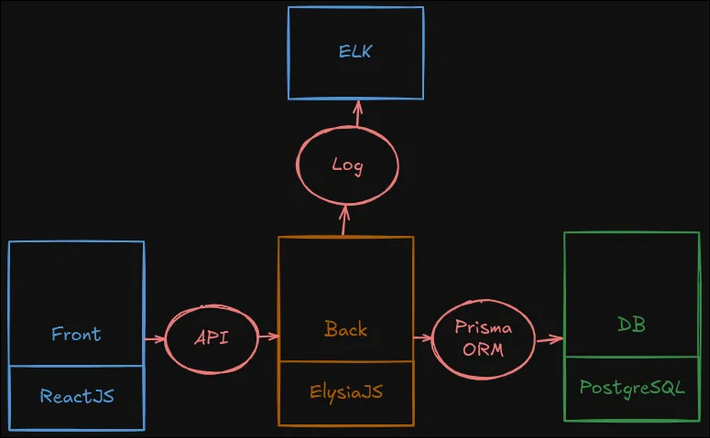
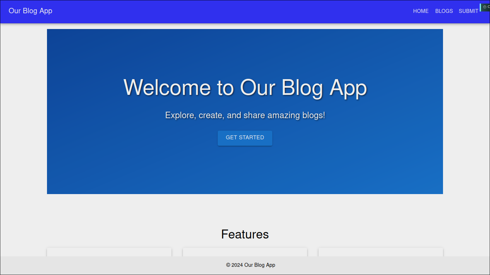
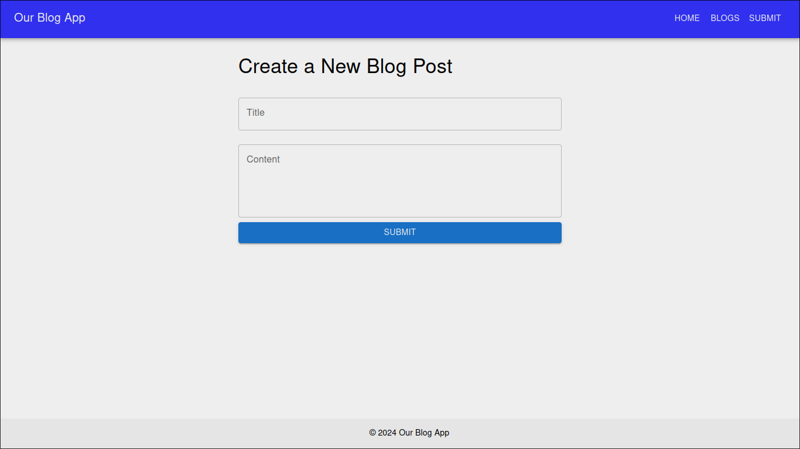
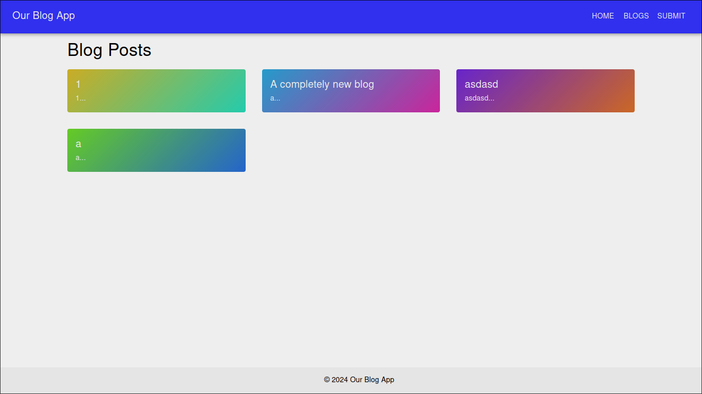
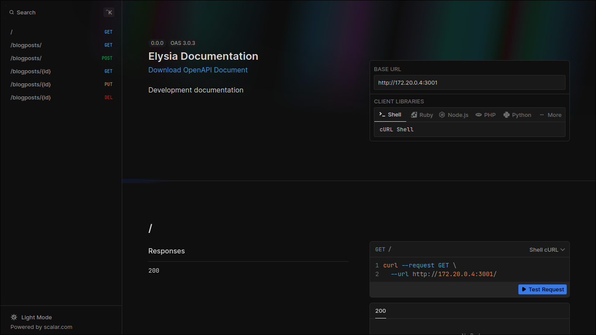
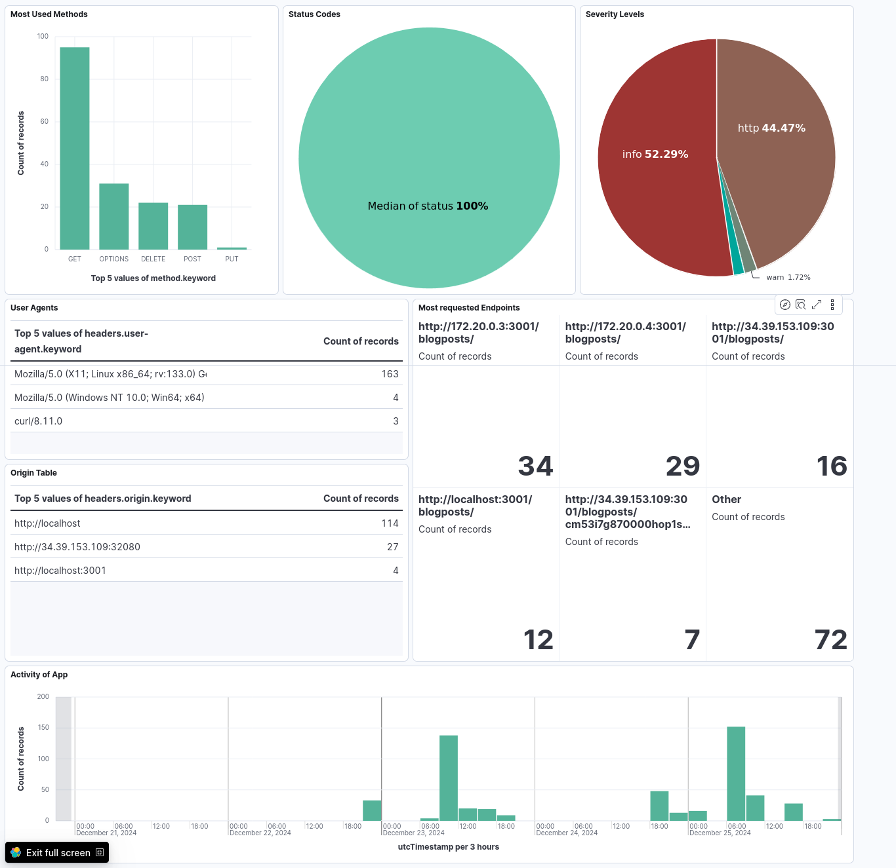

# A simple Blog App



## Functionalities

- create a post
- see other posts
- delete a post

## Tech Stack

- Frontend - `ReactJS` + `MUI`
- Backend - `ElysiaJS` + `BunJS` + `Prisma`
- DB - `PostgreSQL`

## Running it

- setup enviromental variables in `.env`

```bash
docker compose up -d
# If it is your first deployment

bun prisma migrate dev
```

## Tests

```bash
cd back
bun test

cd ..

cd front
npm test
```

## Some Images

- Main Page

> 

- Add a Post

> 

- See a Post

> 

- Bakend API's Swagger

> 

- Log Dashboard

> 
